# Coworking Space Service Extension
The Coworking Space Service is a set of APIs that enables users to request one-time tokens and administrators to authorize access to a coworking space. This service follows a microservice pattern and the APIs are split into distinct services that can be deployed and managed independently of one another.

For this project, you are a DevOps engineer who will be collaborating with a team that is building an API for business analysts. The API provides business analysts basic analytics data on user activity in the service. The application they provide you functions as expected locally and you are expected to help build a pipeline to deploy it in Kubernetes.

## Dependencies

### Local Environment

1. Python Environment - run Python 3.6+ applications and install Python dependencies via `pip`
2. Docker CLI - build and run Docker images locally
3. `kubectl` - run commands against a Kubernetes cluster
4. `helm` - apply Helm Charts to a Kubernetes cluster

### Remote Resources

1. AWS CodeBuild - gaurs-cd12355-codebuild to build Docker images remotely and push them to ECR.
2. AWS ECR - gaurs-cd12355-ecr to store Docker images
3. Kubernetes Environment with AWS EKS -
   1. gaurs-cd12355-cluster EKS cluster
   2. gaurs-cd12355-nodegroup EKS nodegroup
4. AWS CloudWatch - monitor activity and logs in EKS
5. GitHub - [Repo](https://github.com/gaurscode/cd12355-microservices-aws-kubernetes-project-starter) to store code and track changes

Once you have the dependencies set up, you can proceed with the setup by following the instructions below:

```bash
# update local kubeconfig
aws eks update-kubeconfig --name gaurs-cd12355-cluster --region us-east-1 --kubeconfig ~/.kube/config

# verify the connection
kubectl get pods -A
```

## Setup

### Configure a Database

Set up a Postgres database using a Helm Chart.

1. Set up Bitnami Repo: `helm repo add bitnami https://charts.bitnami.com/bitnami`
2. Update the newly added repo: `helm repo update`
3. Create pv for the database: `kubectl apply -f db/pv.yaml`
4. Create pvc for the database: `kubectl apply -f db/pvc.yaml`
5. Install PostgreSQL Helm Chart:

```sh
helm install coworking-db bitnami/postgresql \
 --set primary.persistence.existingClaim=coworking-pvc \
 --set primary.persistence.enabled=true \
 --set primary.persistence.storageClass=gp2 \
 --set volumePermissions.enabled=true
```


By default, it will create a username `postgres`. The password can be retrieved with the following command:

```bash
export POSTGRES_PASSWORD=$(kubectl get secret --namespace default coworking-db-postgresql -o jsonpath="{.data.postgres-password}" | base64 -d)

echo $POSTGRES_PASSWORD
```

## Build Pipeline

The build pipeline is set up using AWS CodeBuild. **The pipeline is triggered when a Pull Request is merged to the main branch.** The pipeline builds the Docker image, tags it, and pushes it to ECR.

Here is a build spec for the pipeline:

```yaml
version: 0.2

phases:
  pre_build:
    commands:
      - echo Logging into ECR
      - aws ecr get-login-password --region $AWS_DEFAULT_REGION | docker login --username AWS --password-stdin $AWS_ACCOUNT_ID.dkr.ecr.$AWS_DEFAULT_REGION.amazonaws.com
  build:
    commands:
      - echo Starting build at `date`
      - echo Building the Docker image          
      - docker build -t $IMAGE_REPO_NAME:$CODEBUILD_BUILD_NUMBER .
      - docker tag $IMAGE_REPO_NAME:$CODEBUILD_BUILD_NUMBER $AWS_ACCOUNT_ID.dkr.ecr.$AWS_DEFAULT_REGION.amazonaws.com/$IMAGE_REPO_NAME:$CODEBUILD_BUILD_NUMBER      
  post_build:
    commands:
      - echo Completed build at `date`
      - echo Pushing the Docker image...
      - docker push $AWS_ACCOUNT_ID.dkr.ecr.$AWS_DEFAULT_REGION.amazonaws.com/$IMAGE_REPO_NAME:$CODEBUILD_BUILD_NUMBER
```

This build spec is used to build the Docker image and push it to ECR using the following Dockerfile:

```bash
# Use 
FROM python:alpine3.19

# Set the working directory inside the container
WORKDIR /app

# Copy the current directory contents to the container at /app
COPY /analytics/ /app

# Install dependencies from requirements.txt
RUN pip install --no-cache-dir -r /app/requirements.txt

# Expose port 5000
EXPOSE 5000

# Set environment variable(s)
ENV DB_USERNAME=postgres
ENV DB_PASSWORD=********
ENV DB_HOST=coworking-db-postgresql
ENV DB_PORT=5432
ENV DB_NAME=postgres

# Run the application when the container starts
CMD python /app/app.py
```

Once the code is committed to the repository, the pipeline is triggered and the Docker image is built and pushed to ECR.

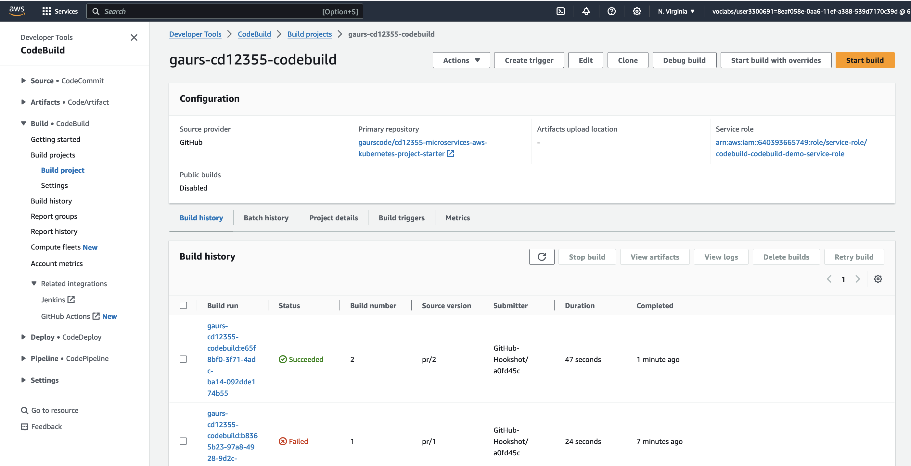

We can see the image in the ECR repository:

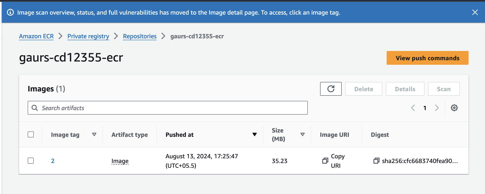

## Deploy to Kubernetes

We will start with setting up the required configurations and secrets in Kubernetes: `kubectl apply -f configmap.yaml`. The configmap contains the environment variables required by the application.

The same can be verified as:

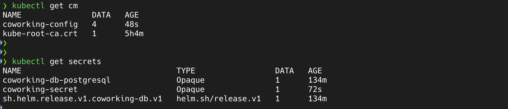

Post this, we will deploy the application using the following command: `kubectl apply -f coworking.yaml`. The deployment creates a pod with the application and a service to expose the application.

Once done, we can verify the deployment and service using the following commands:

```bash
kubectl get deploy
kubectl get pods
kubectl get svc
```

`Services and Deployment`

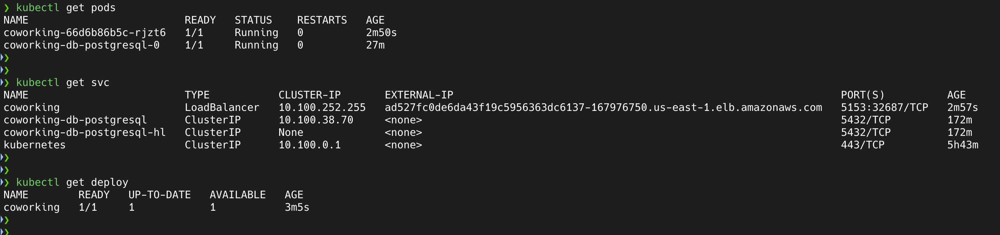

`Describe Deployment`

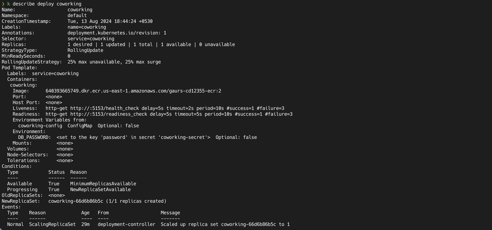

`Application Pod`

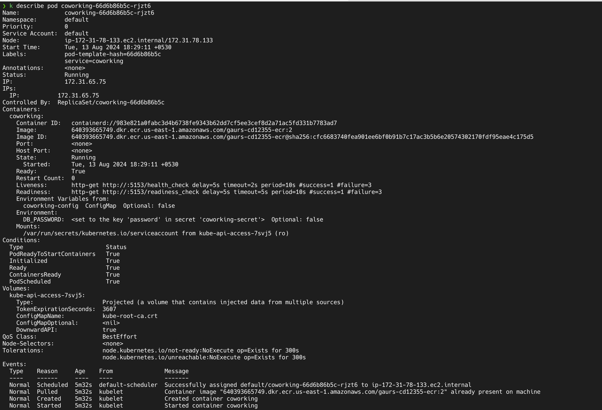

`DB Pod`

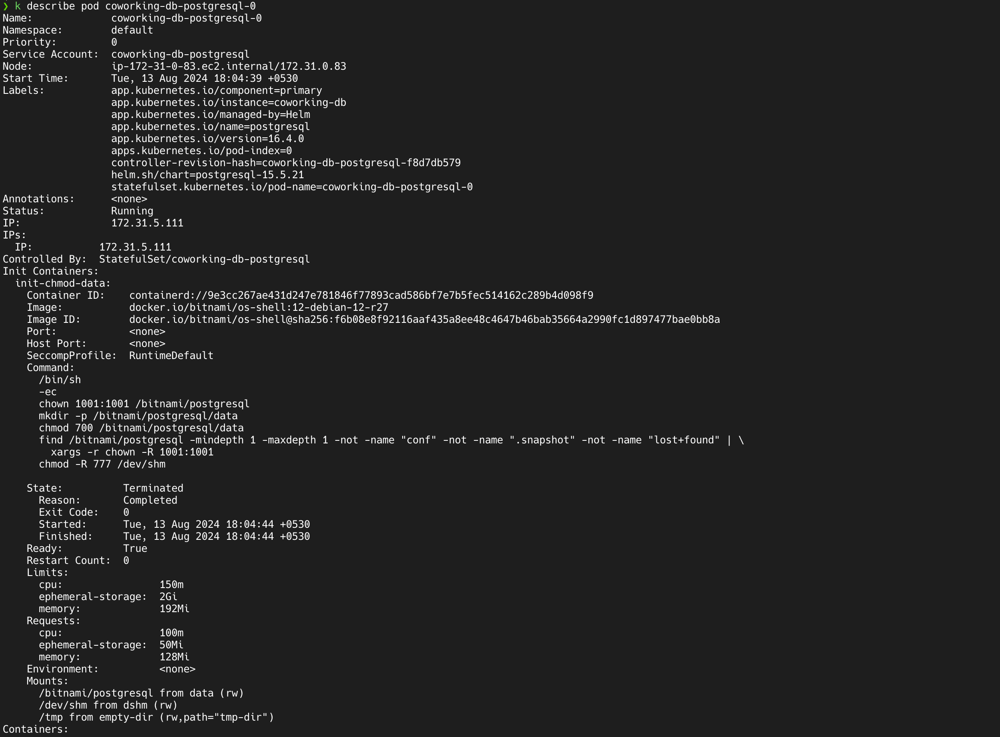

`App Service`

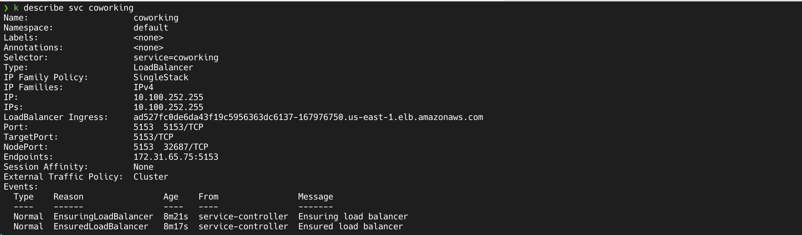

`DB Service`

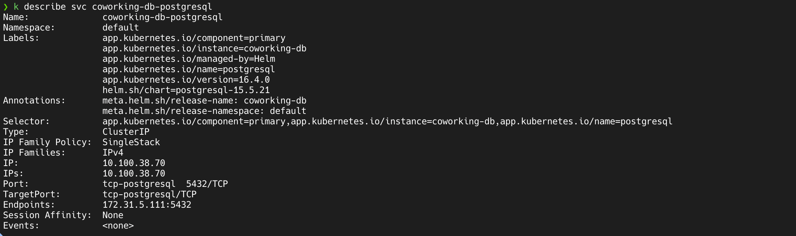

## AWS CloudWatch Logs

### Application Logs

Update IAM policy:

```sh
aws iam attach-role-policy \
--role-name arn:aws:iam::640393665749:role/eks-node-group-role \
--policy-arn arn:aws:iam::aws:policy/CloudWatchAgentServerPolicy
```

Install CloudWatch Agent:

```sh
aws eks create-addon --addon-name amazon-cloudwatch-observability --cluster-name gaurs-cd12355-cluster
```

Once the agent is installed, we can see the logs in CloudWatch:

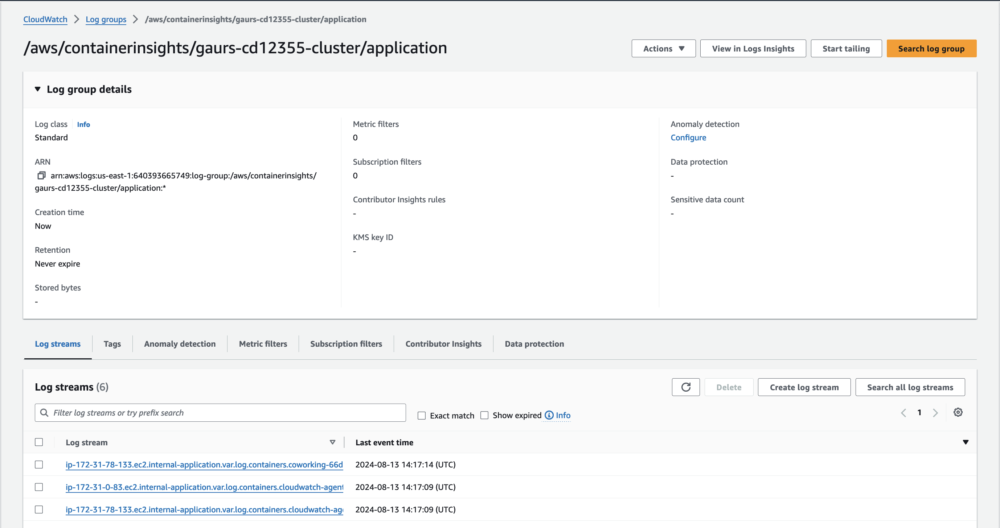

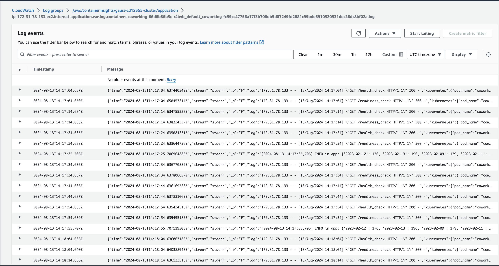

### Cluster Logs

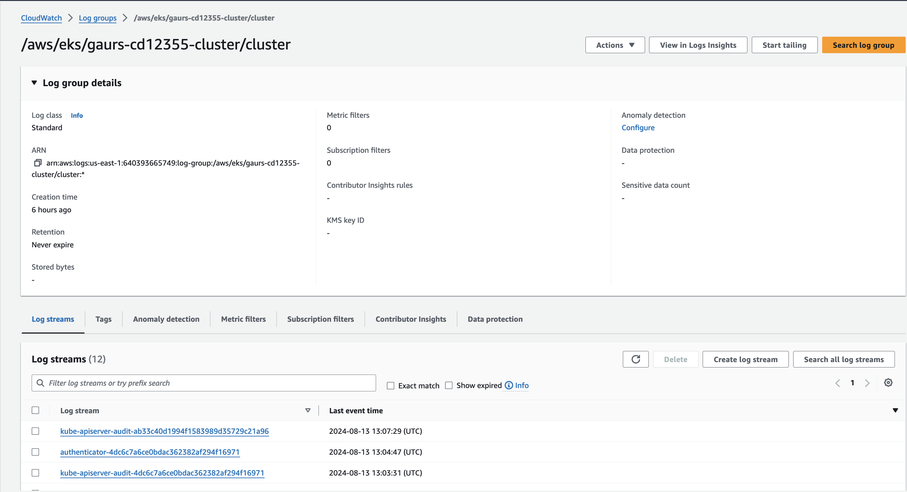

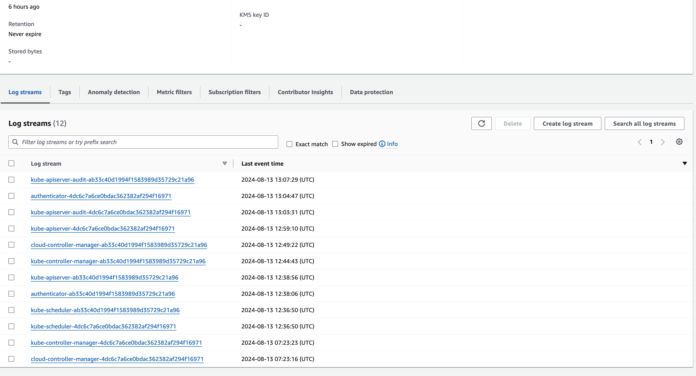

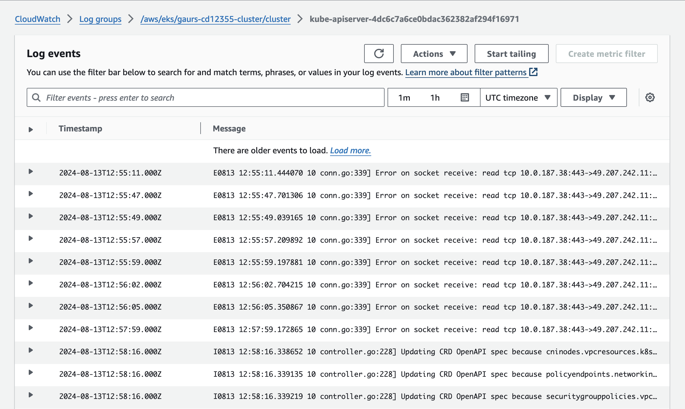

## Deliverables

1. Dockerfile - done
2. Screenshot of AWS CodeBuild pipeline - done
3. Screenshot of AWS ECR repository for the application's repository - done
4. Screenshot of kubectl get svc - done
5. Screenshot of kubectl get pods - done
6. Screenshot of kubectl describe svc <DATABASE_SERVICE_NAME> - done
7. Screenshot of kubectl describe deployment <SERVICE_NAME> - done
8. All Kubernetes config files used for deployment (ie YAML files) - done
9. Screenshot of AWS CloudWatch logs for the application - done
10. README.md - done

Please check the [images](./images/) for the screenshots.
