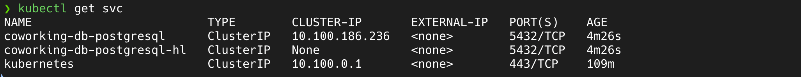

# Coworking Space Service Extension

The Coworking Space Service is a set of APIs that enables users to request one-time tokens and administrators to authorize access to a coworking space. This service follows a microservice pattern and the APIs are split into distinct services that can be deployed and managed independently of one another.

For this project, you are a DevOps engineer who will be collaborating with a team that is building an API for business analysts. The API provides business analysts basic analytics data on user activity in the service. The application they provide you functions as expected locally and you are expected to help build a pipeline to deploy it in Kubernetes.

## Setup

### Configure a Database

Set up a Postgres database using a Helm Chart.

1. Set up Bitnami Repo: `helm repo add bitnami https://charts.bitnami.com/bitnami`
2. Update the newly added repo: `helm repo update`
3. Create pv for the database: `kubectl apply -f db/pv.yaml`
4. Create pvc for the database: `kubectl apply -f db/pvc.yaml`
5. Install PostgreSQL Helm Chart:

```sh
helm install coworking-db bitnami/postgresql \
 --set primary.persistence.existingClaim=coworking-pvc \
 --set primary.persistence.enabled=true \
 --set primary.persistence.storageClass=gp2 \
 --set volumePermissions.enabled=true
```



By default, it will create a username `postgres`. The password can be retrieved with the following command:

```bash
export POSTGRES_PASSWORD=$(kubectl get secret --namespace default coworking-db-postgresql -o jsonpath="{.data.postgres-password}" | base64 -d)

echo $POSTGRES_PASSWORD
```

## Build Pipeline

**The pipeline using AWS CodeBuild is triggered when a Pull Request is merged to the main branch.** The pipeline builds the Docker image, tags it, and pushes it to ECR.

Thw two main files required for the pipeline are: `buildspec.yml` and `Dockerfile`.

## Deploy to Kubernetes

We will start with setting up the required configurations and secrets in Kubernetes: `kubectl apply -f configmap.yaml`. The configmap contains the environment variables required by the application.

Post this, we will deploy the application using the following command: `kubectl apply -f coworking.yaml`. The deployment creates a pod with the application and a service to expose the application.

Once done, we can verify the deployment and service using the following commands:

```bash
kubectl get deploy
kubectl get pods
kubectl get svc
```

The corresponding screen shots are available in the [images](./images/) folder.

## AWS CloudWatch Logs

### Application Logs

To view the application logs in CloudWatch, we need to install the CloudWatch agent on the EKS cluster. The agent requires the following IAM permissions:

```sh
aws iam attach-role-policy \
--role-name arn:aws:iam::640393665749:role/eks-node-group-role \
--policy-arn arn:aws:iam::aws:policy/CloudWatchAgentServerPolicy
```

Install CloudWatch Agent: `aws eks create-addon --addon-name amazon-cloudwatch-observability --cluster-name gaurs-cd12355-cluster`

Once the agent is installed, we can see the logs in CloudWatch. The corresponding screen shots are available in the [images](./images/) folder.
